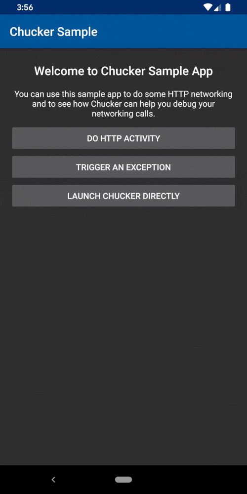
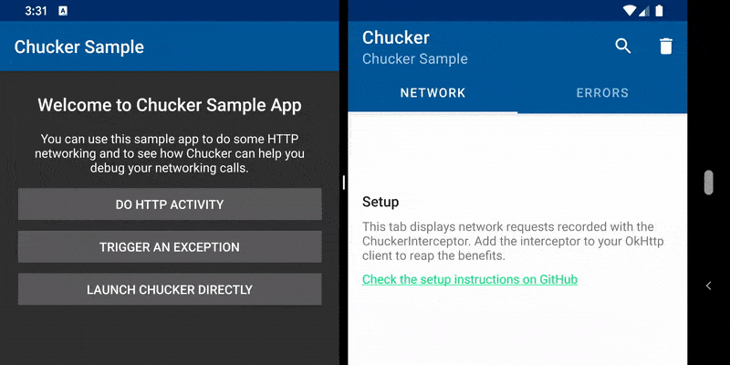

# Chucker

Chucker simplifies the inspection of **HTTP(S) requests/responses** fired by your Android App. Chucker works as an **OkHttp Interceptor** persisting all those events inside your application, and providing a UI for inspecting and sharing their content.

Apps using Chucker will display a **push notification** showing a summary of ongoing HTTP activity. Tapping on the notification launches the full Chucker UI. Apps can optionally suppress the notification, and launch the Chucker UI directly from within their own interface.

<p align="center">
  
</p>

## Features 🧰

Don't forget to check the [changelog](CHANGELOG.md) to have a look at all the changes in the latest version of Chucker.

* Compatible with **OkHTTP 4**
* **API >= 21** compatible
* Easy to integrate (just 2 gradle `implementation` lines).
* Works **out of the box**, no customization needed.
* **Empty release artifact** 🧼 (no traces of Chucker in your final APK).
* Support for body text search with **highlighting** 🕵️‍♂️
* Support for showing **images** in HTTP Responses 🖼

### Multi-Window 🚪

The main Chucker activity is launched in its own task, allowing it to be displayed alongside the host app UI using Android 7.x multi-window support.



### Redact-Header 👮‍♂️

**Warning** The data generated and stored when using Chucker may contain sensitive information such as Authorization or Cookie headers, and the contents of request and response bodies.

It is intended for **use during development**, and not in release builds or other production deployments.

You can redact headers that contain sensitive information by calling `redactHeader(String)` on the `ChuckerInterceptor`.

```kotlin
interceptor.redactHeader("Auth-Token", "User-Session");
```
